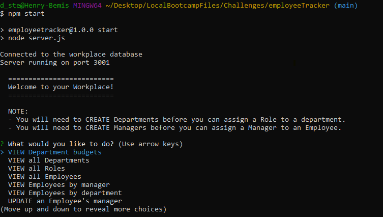

# Employee Tracker 

## Description
Employee Tracker is a content management system (CMS) that can be accessed via the command line. It was created using Node.js, with the following npm packages: Inquirer, Express, and MySQL. The intention of this application is to keep track of employees in a workplace including what department they work in, how much money they make, who their manager is, etc.

## Table of Contents
* [Installation](#installation)
* [Usage](#usage)
* [Contributing](#contributing)
* [Questions](#questions)
* [Deployed Application](#deployed-application)

## Installation
Go to the following link to download and extract the zip files to your computer. Once that is complete, open your terminal to the path location of the application and type 'npm start' into the command line. The application will then open, and it can be terminated by clicking 'ctrl + c' at the same time.

## Usage
Once the application is open, simply use your arrow and enter keys to make your desired selections, and type your input when prompted. You can also watch [this video](https://watch.screencastify.com/v/BgRRtJeks19RN3VT1CYb) for a walk-through.

## Contributing
This is an open source project and as such, please follow the [Contributor Covenant](https://www.contributor-covenant.org/).

## Questions
Check out my GitHub profile [here!](https://www.github.com/spaghettimedic) I can be reached directly at dsteiner247@gmail.com should you have any questions.

## Deployed Application
https://github.com/spaghettimedic/employeeTracker